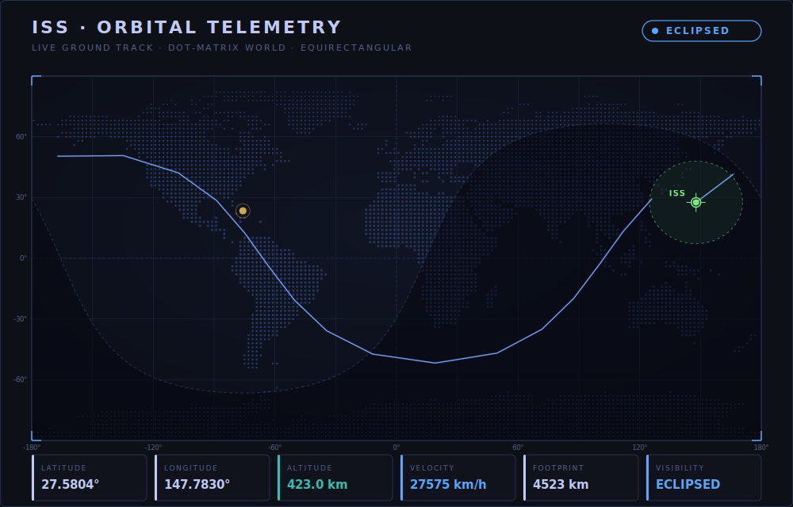

<h1 align="center">Muneeb Farooq</h1>

  <b>Backend &amp; Security Engineer</b> &middot; secure, scalable systems and developer-first APIs

  
  
  
  

  <i>This profile is a live dashboard. Everything below refreshes automatically from public APIs.</i>

---

## ISS Live Position

  

Current position, next-orbit ground track, day/night terminator, and live telemetry. Source: wheretheiss.at tracking NORAD 25544, refreshed every 6 hours via GitHub Actions.

---

## Snapshot

<!-- SNAPSHOT:START -->
| Public repos | Total stars | Followers | Following | Member since | Last active |
| :--: | :--: | :--: | :--: | :--: | :--: |
| 10 | 2 | 6 | 7 | 2022 | 2026-06-19 |
<!-- SNAPSHOT:END -->

---

## Projects

<!-- PROJECTS:START -->
| Repository | Language | Stars | Updated | Description |
| :-- | :-- | :--: | :--: | :-- |
| [my-portfolio](https://github.com/GamingSeries/my-portfolio) | TypeScript | 1 | 2024-02-02 | - |
| [learn_draft1](https://github.com/GamingSeries/learn_draft1) | Python | 0 | 2024-03-31 | fully functional backend and frontend website with multi platform compatibility, created using Python framework Django |
| [weekly_report_system](https://github.com/GamingSeries/weekly_report_system) | Python | 0 | 2023-11-09 | - |
| [Face_Recognition_System](https://github.com/GamingSeries/Face_Recognition_System) | Python | 0 | 2023-05-29 | - |
| [Hospital_Management](https://github.com/GamingSeries/Hospital_Management) | Java | 0 | 2022-11-30 | - |
<!-- PROJECTS:END -->

<a href="https://github.com/GamingSeries?tab=repositories"><b>Browse all repositories</b></a>

---

## Recent Activity

<!-- ACTIVITY:START -->
- `2026-06-19` Pushed 4 commits to [GamingSeries/GamingSeries](https://github.com/GamingSeries/GamingSeries)
- `2026-06-14` Created branch `claude/highwaycrm-repo-setup-113sxs` in [GamingSeries/GamingSeries](https://github.com/GamingSeries/GamingSeries)
- `2026-06-11` Pushed 1 commit to [GamingSeries/GamingSeries](https://github.com/GamingSeries/GamingSeries)
<!-- ACTIVITY:END -->

---

## GitHub Stats

  
  

  

  

---

## Live Signals

Public space and earth data, refreshed automatically (no manual updates, no API keys required beyond NASA's public DEMO_KEY).

<!-- SIGNALS:START -->
| Live signal | Reading |
| :-- | :-- |
| Near-Earth objects today (NASA) | 5 tracked, 1 flagged potentially hazardous |
| Latest M4.5+ earthquake (USGS) | M6 - 49 km E of Noda, Japan (2026-07-01 12:08 UTC) |
<!-- SIGNALS:END -->

---

<!-- UPDATED:START -->

Auto-refreshed 2026-07-01 14:08 UTC via GitHub Actions

<!-- UPDATED:END -->

  <i>Open to collaboration on backend, security, and developer-tooling projects. Reach out via <a href="mailto:info@neptlabs.com">email</a> or <a href="https://www.linkedin.com/in/muneebfarooq">LinkedIn</a>.</i>

