<h1 align="center">Muneeb Farooq</h1>

  <b>Backend &amp; Security Engineer</b> — building secure, scalable systems and developer-first APIs.

  
  
  

  

---

## About

- I work at the intersection of cybersecurity and backend development, designing systems built for automation, reliability, and efficiency.
- Builder at [Neptune Labs](https://neptlabs.com), shipping secure APIs and developer tooling.
- Focus areas: API design, authentication and authorization, and distributed backends.
- Currently exploring AI-powered security tooling and ML-based fraud detection.

---

## Tech Stack

  

---

## Featured Projects

| Project | Description |
| :------ | :---------- |
| **[OneAPI](https://github.com/GamingSeries/OneAPI)** | Secure, seamless API authentication. |
| **[AI Labs](https://github.com/GamingSeries/AILabs)** | AI-driven API management. |
| **[QRVI](https://github.com/GamingSeries/QRVI)** | Quantum Resonance Vehicle Identification — next-gen vehicle recognition. |

**[Browse all repositories](https://github.com/GamingSeries?tab=repositories)**

---

## Live World Feed

A snapshot of the planet, refreshed hourly via GitHub Actions (public data, no API keys).

<!-- WORLD-FEED:START -->
| Signal | Reading |
| --- | --- |
| ISS ground position | -28.05 deg, -19.92 deg |
| Latest M4.5+ earthquake | M4.7 - Fiji region (2026-06-19 15:28 UTC) |
| Last updated | 2026-06-19 16:18 UTC |
<!-- WORLD-FEED:END -->

---

## GitHub Stats

  
  

  

  

---

  <i>Open to collaboration on backend, security, and developer-tooling projects. Reach out via <a href="mailto:info@neptlabs.com">email</a> or <a href="https://www.linkedin.com/in/muneebfarooq">LinkedIn</a>.</i>

